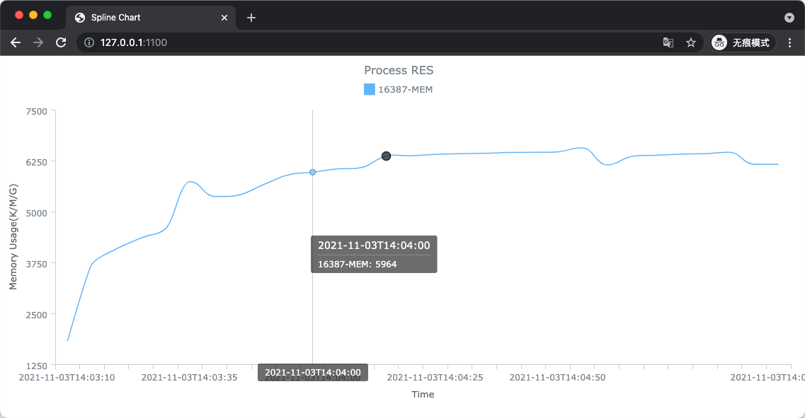

# gg-top

run top to collect process rss every interval like 5m.

features:

1. collect process top information, like `gg-top -pids java,other`, or `gg-top -pids 19107,20030`
2. generate a html tar.gz package based on the output file, like `gg-top -file gg-top-20211103170500.json:generate`,
   then download it, decompress it, click index.html to see the data in the browser.
3. to view data directly by gg-top provided service, like `gg-top -file gg-top-20211103170500.json`, then
   open http://127.0.0.1:1100 to view the data.
4. to run at background: `gg-top -init`, `./ctl start -pids java,other -interval 5m`
5. specified y-axis's fields: `http://127.0.0.1:1100/?f=load1,load5`



```sh
# top -bn1 -p 12130,19107,20030,23134,28418
top - 17:05:25 up 5 days,  7:17,  5 users,  load average: 0.09, 0.11, 0.20
Tasks:   4 total,   0 running,   4 sleeping,   0 stopped,   0 zombie
%Cpu(s):  0.0 us,  0.0 sy,  0.0 ni,100.0 id,  0.0 wa,  0.0 hi,  0.0 si,  0.0 st
KiB Mem :  8009040 total,  1289372 free,  3446920 used,  3272748 buff/cache
KiB Swap:  8257532 total,  8239604 free,    17928 used.  3889504 avail Mem

  PID USER      PR  NI    VIRT    RES    SHR S  %CPU %MEM     TIME+ COMMAND
19107 root      20   0 4138752 127016  15448 S   0.0  1.6   3:44.85 java
20030 zookeep+  20   0 4886472  93252  12916 S   0.0  1.2  10:09.40 java
23134 kafka     20   0 5308960   1.1g  20748 S   0.0 14.6 186:13.69 java
28418 elastic+  20   0 4317700   1.0g 128396 S   0.0 13.2  37:41.67 java
# gg-top -pids java
2021/11/03 17:05:32 start to exec shell "ps -ef|grep -v grep|grep '\bjava\b'|awk '{print $2}'|xargs|sed 's/ /,/g'"
2021/11/03 17:05:32 Start to listen on :1100
2021/11/03 17:05:32 start to collect top information for pids 12844,19107,20030,23134,28418
2021/11/03 17:05:32 start to exec shell "top -bn1 -p 12844,19107,20030,23134,28418"
2021/11/03 17:05:32 ["timestamp","load1","load5","load15","12844-VIRT","12844-RES","12844-SHR","12844-%CPU","12844-%MEM","12844-COMMAND","19107-VIRT","19107-RES","19107-SHR","19107-%CPU","19107-%MEM","19107-COMMAND","20030-VIRT","20030-RES","20030-SHR","20030-%CPU","20030-%MEM","20030-COMMAND","23134-VIRT","23134-RES","23134-SHR","23134-%CPU","23134-%MEM","23134-COMMAND","28418-VIRT","28418-RES","28418-SHR","28418-%CPU","28418-%MEM","28418-COMMAND"]
2021/11/03 17:05:32 ["2021-11-03T17:05:00",0.08, 0.11, 0.20,709776,8824,4,0.0,0.1,"gg-top",4138752,127016,15448,0.0,1.6,"java",4886472,93252,12916,0.0,1.2,"java",5308960,1153433.6,20748,0.0,14.6,"java",4317700,1048576,128396,0.0,13.2,"java"]
2021/11/03 17:06:32 start to exec shell "ps -ef|grep -v grep|grep '\bjava\b'|awk '{print $2}'|xargs|sed 's/ /,/g'"
2021/11/03 17:06:32 start to collect top information for pids 12844,19107,20030,23134,28418
2021/11/03 17:06:32 start to exec shell "top -bn1 -p 12844,19107,20030,23134,28418"
2021/11/03 17:06:32 ["2021-11-03T17:06:00",0.06, 0.10, 0.19,710288,10220,4,0.0,0.1,"gg-top",4138752,127016,15448,0.0,1.6,"java",4886472,93252,12916,0.0,1.2,"java",5308960,1153433.6,20748,6.7,14.6,"java",4317700,1048576,128396,0.0,13.2,"java"]
2021/11/03 17:07:32 start to exec shell "ps -ef|grep -v grep|grep '\bjava\b'|awk '{print $2}'|xargs|sed 's/ /,/g'"
2021/11/03 17:07:32 start to collect top information for pids 12844,19107,20030,23134,28418
2021/11/03 17:07:32 start to exec shell "top -bn1 -p 12844,19107,20030,23134,28418"
2021/11/03 17:07:32 ["2021-11-03T17:07:00",0.13, 0.13, 0.20,710288,10924,4,0.0,0.1,"gg-top",4138752,127016,15448,0.0,1.6,"java",4886472,93252,12916,0.0,1.2,"java",5308960,1153433.6,20748,0.0,14.6,"java",4317700,1048576,128396,0.0,13.2,"java"]
```
